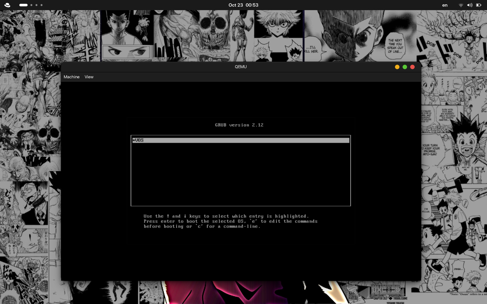

# VOS Build & Development Guide



## Project Structure Overview

```
project/
├── vos/                # Source directory
│   ├── boot/           # Bootloader + 16 bit BIOS interupts (ASM)
│   ├── kernel/         # Kernel C + ASM sources
│   └── include/        # C header files
├── grub/               # GRUB boot configuration
├── build/              # Compiled objects and binaries
├── iso/                # Temporary ISO structure
├── Makefile
└── README.md (this file)
```

## Dependencies

The Makefile expects the following tools installed:

* `nasm` (Assembler)
* `gcc` (C compiler)
* `ld` (Linker)
* `grub2-mkrescue` (GRUB ISO builder)
* `qemu-system-i386` (Emulator)
* 32-bit development libraries (`glibc-devel.i686`, `libgcc.i686`)

#### Install everything automatically:

Change the PACKAGE_MGR var on the Makefile to the coresponding package manager (dnf is the default).

```sh
make dependencies
```

## Build Commands

#### **🧼 Clean build directories**

```sh
make clean
```

Removes everything in `build/` and `iso/`.

### Setup build environment
```sh
make setup
```

Creates the required folder structure.

### Build OS binaries

This compiles ASM and C code, then links everything into `vos.bin`.

```sh
make bins
```

Equivalent to running:

* `make c_bins` → Compile kernel C files
* `make asm_bins` → Compile ASM sources
* `make link` → Link everything into the kernel binar

## Creating the Bootable ISO

### Build final ISO (release mode):

```sh
make iso
```

This produces:

```
build/vos.iso
```

This ISO can be booted by QEMU or burned to media.

---

## Emulate the OS (shortest Path):

### Run OS in QEMU:
```sh
make emulate
```

## Debugging

The Makefile supports GDB debugging with QEMU.

### Build debug binaries:

```sh
make debug_bins
```

This compiles C code with debug symbols (`-g`).

### Generate debug ISO:

```sh
make demulate
```

This runs QEMU in debug mode:

* `-S` (CPU stops on startup)
* `-s` (opens port 1234 for GDB)

### **Attach GDB:**

```sh
make debug
```

This opens GDB and connects to the QEMU instance.

---

## 🔁 Full Workflow Examples

### **1. Build & run the OS:**

```sh
make clean
make iso
make emulate
```

### **2. Debug the kernel:**

```sh
make demulate     # Start QEMU waiting for GDB
make debug        # Attach GDB
```

---