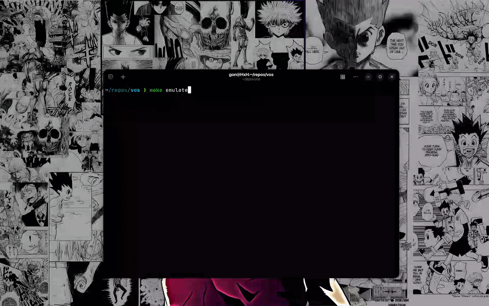

# VOS Build & Development Guide



## Project Structure Overview

```
project/
├── vos/                # Source directory
│   ├── boot/           # Bootloader + 16 bit BIOS interupts (ASM)
│   ├── kernel/         # Kernel C + ASM sources
│   ├── shell/          # Internal kernel shell features
│   ├── coreutils/      # Core utilities and basic programs
│   └── include/        # C header files
├── grub/               # GRUB boot configuration
├── build/              # Compiled objects and binaries
├── iso/                # Temporary ISO structure
├── Makefile
└── README.md (this file)
```

## Build Commands

The Makefile supports the following commands:

- `make dependencies`: Install required tools automatically on Fedora/RHEL (`gcc`, `ld`, `nasm`, etc.).
- `make arch-dependencies`: Install required tools on Arch Linux (`nasm`, `base-devel`, `qemu-full`, etc.).
- `make emulate`: Run OS in QEMU.
- `make demulate`: Run QEMU in debug mode waiting for GDB.
- `make clean`: Removes everything in `build/` and `iso/`.
- `make bins`: Compile ASM and C code, then links everything into the kernel binary.
- `make iso`: Build final bootable ISO.

## Memory Management Macros

Here are some important memory macros and linker symbols defined across the system:

- `KERNEL_OFFSET`: Virtual memory offset for the kernel (`0xC0000000`).
- `KERNEL_START` / `KERNEL_END`: Addresses marking the beginning and end of the kernel in memory.
- `PAGE_SIZE`: Size of a single memory page (`4096` bytes).
- `PAGE_MASK`: Mask to align an address to a page boundary (`0xFFFFF000`).
- `PDE_COUNT` / `PTE_COUNT`: Number of entries in a Page Directory and Page Table (`1024`).
- `VMM_RECURSIVE_PD` / `VMM_RECURSIVE_PT`: Virtual addresses used for recursive page directory and table mapping (`0xFFFFF000` / `0xFFC00000`).
- `VMM_SCRATCHPAD`: Address used for temporary page mapping operations.
- `KERNEL_STACK_TOP`: Top of the kernel stack (`0xFFC00000`).
- `HEAP_START`: Start address of the kernel heap.
- `MAX_PAGES`: Maximum physical pages supported (`1048576` pages = 4GB limit).
- `KERNEL_CODE_PAGES` / `KERNEL_PAGES`: Number of pages occupied by kernel code and total kernel pages.

## License

This project is licensed under the GPL v3 License.
